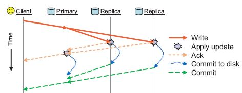

# Ceph 读写流程

## 1、读流程

ceph 的 读，只需要访问Primary OSD，读取相应的内容即可


## 2、写流程

### 2.1、读写流程的分叉点

下图是从运行队列开始取出消息，一直到FileStore从磁盘中读到文件的内容的过程。箭头指向 表示A调用B。   从execute\_ctx开始，进去读写流程的分叉点。


### 2.2、写流程两阶段


写的时候，client只会和Primary OSD间有消息交互，至于其它副本的数据写入，要靠Primary OSD发送请求通知它们，当然当Replica OSD写完之后，需要发送消息告知Primary OSD， Primary OSD汇总各个OSD的写入情况，在合适的时机给Client发送响应信息。



1. 第一阶段：写入Journal，如果Primary同时收到了所有的OSD的消息，确认所有OSD上的第一阶段任务完成，就会给Client回复第一个消息，表示写入已经完成。此处花费的时间为`fs_commit_latency(ms)`。
2. 第二阶段：写入磁盘。如果Primary同时收到了所有的OSD的消息，确认所有OSD上的第二阶段任务完成，就会给Client回复一个消息，表示数据可读。此处花费的时间为`fs_apply_latency(ms)`。

但注意，第二阶段，实际上是写入Linux 的 Page Cache，FileStore中的sync\_thread负责周期性地执行syncfs，进行实际落盘。

## 3、读写的并发

不同的对象有可能落到同一个PG里。Ceph实现里，OSD的`osd_op_tp`里的线程处理过程在获取PG Lock后，只会把op组装为transaction后交给FileStore的work queue，然后就返回释放PG Lock了。

返回后写的数据可能还没有写到journal和disk，即还没有commit/apply成功；

所以针对同一个object的操作，虽说对它的操作有PG Lock，但也可能在PG Lock释放后，对object的实际操作RW还没有完成；

这就引入了object的读写锁，即`struct ObjectContext`里的`struct RWState`，通过它来互斥对同一object的读写，但允许对同一object的同时多读、同时多写（详细见下面RWState的分析）；

对于同时多写，因为有PG Lock，所以多写并不会引起data consistency问题（PG Lock保证多写是顺序的），多个写提交到FileStore后可以并发或合并（**待分析**）；

而op无论是出错、锁竞争、操作完成的情况下，都会调用`close_op_ctx()`，它会把等待在object的RWState锁上的op重新入队处理。

## 4、rw locks

当硬盘性能不佳时，如果虚机上有数据库业务，对数据进行高速的更新读写操作，此时日志里面就可能会出现slow request警告，对应osd日志中的rw locks。


osd\_op\_thread\_timeout的默认值是15s，请求等待时间稍微过后，op\_thread便会超时，如果等待时间够长，最后osd会由于超时而自杀，导致集群不稳定。可调整参数

```text
[osd]
#leveldb 中压缩 omap的参数
osd_compact_leveldb_on_mount = true
leveldb_compact_on_mount = true

#应对rw locks的参数
osd_op_thread_timeout = 90
osd_op_thread_suicide_timeout = 300
filestore_op_thread_timeout = 120
filestore_op_thread_suicide_timeout = 300
```

## 5、参考链接

[Ceph PG Lock and RWState](http://www.yangguanjun.com/2017/05/24/Ceph-PGLock-RWState/)

[ceph pg 写流程](http://bean-li.github.io/ceph-write-flow/)

[ceph日志系列之index-osd读流程](http://strugglesquirrel.com/2018/12/18/%E7%9C%8B%E6%87%82ceph%E6%97%A5%E5%BF%97%E7%B3%BB%E5%88%97%E4%B9%8Bindex-osd%E8%AF%BB%E6%B5%81%E7%A8%8B-%E4%B8%8A/)

[ceph中对象读写的顺序性及并发性保证](http://www.sysnote.org/2016/08/29/ceph-io-sequence/)

[CEPH Config](https://docs.ceph.com/docs/jewel/rados/configuration/osd-config-ref/)


